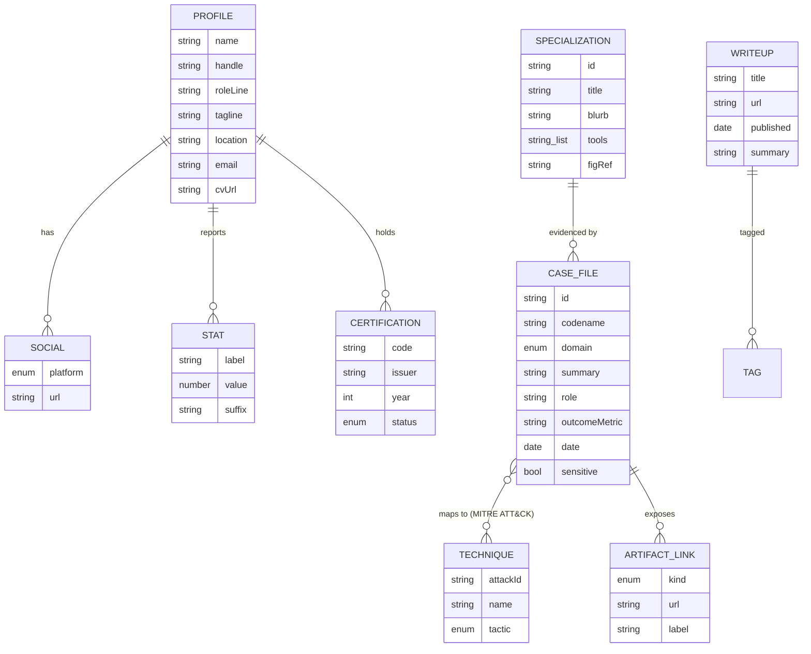

# Data Model (ERD) & Information Architecture

Static site → no database. The "ERD" below is the **typed content model** that lives in
`src/data/*.ts` and is consumed at build time by Astro components.

## 1. Entity-Relationship Diagram



## 2. Sitemap / IA

```
/                     Single-page portfolio (primary deliverable)
├── #hero             FR-1 identity + terminal
├── #figures          FR-2 FIG plates (detection pipeline, DFIR workflow)
├── #stats            FR-3 counters
├── #specializations  FR-4 capability cards
├── #cases            FR-5 case files (filterable)
├── #certs            FR-6 certifications strip
├── #about            FR-7 bio + timeline + skills matrix
└── colophon footer   contact command, socials, copyright

/writeups/index.html   Optional page: list of external writeups (phase 2)
404.html               Themed error page
```

## 3. File mapping

| Model entity | Source of truth |
|---|---|
| Profile / Social / Stat | `src/data/profile.ts` |
| Specialization | `src/data/specializations.ts` |
| CaseFile / Technique | `src/data/cases.ts` |
| Certification | `src/data/certifications.ts` |
| Writeup | `src/data/writeups.ts` |

**Rule:** all human-editable content lives in `src/data/`. Components contain zero
hard-coded copy.
